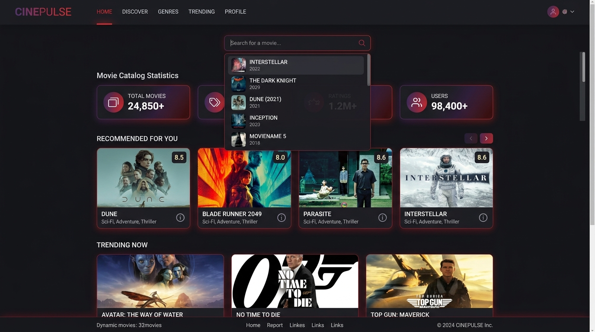
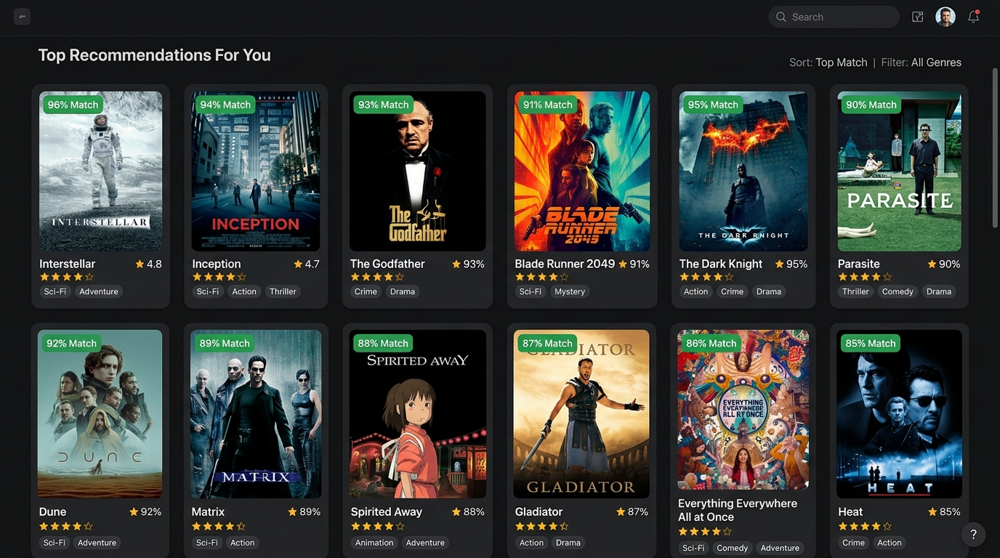
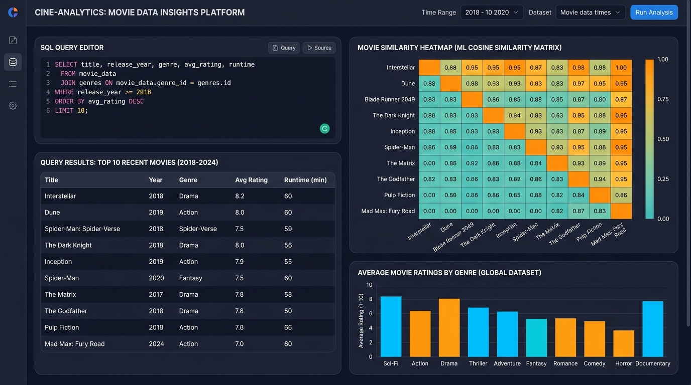

# 🎬 Movie Recommendation System

[](https://movie-recommendation-systemgit-ryp9wamswmrnmusjugepw7.streamlit.app/)
[](https://www.python.org/)
[](https://pandas.pydata.org/)
[](https://numpy.org/)
[](https://scikit-learn.org/)
[](https://streamlit.io/)
[](https://www.sqlite.org/)
[](LICENSE)

> A production-ready, content-based Movie Recommendation System built with **Python**, **Scikit-Learn**, **SQL**, and **Streamlit**. Evaluates multi-attribute metadata affinities using **TF-IDF Vectorization** and high-dimensional **Cosine Similarity** to instantly recommend films matching a user's taste.

---

## 📌 Table of Contents
1. [About the Project](#-about-the-project)
2. [Problem Statement](#-problem-statement)
3. [Objective](#-objective)
4. [Key Features](#-key-features)
5. [Technologies Used](#-technologies-used)
6. [Dataset](#-dataset)
7. [Machine Learning Methodology](#-machine-learning-methodology)
8. [Data Science Workflow](#-data-science-workflow)
9. [Relational SQL Analytics](#-relational-sql-analytics)
10. [Project Folder Structure](#-project-folder-structure)
11. [Application Screenshots](#-application-screenshots)
12. [Live Demo & Free Cloud Deployment](#-live-demo--free-cloud-deployment)
13. [Local Installation & Setup](#-local-installation--setup)
14. [Project Documentation & Interview Guide](#-project-documentation--interview-guide)
15. [Author](#-author)
16. [License](#-license)

---

## 📖 About the Project
Finding engaging films within modern streaming catalogs has become increasingly challenging. The **Movie Recommendation System** solves this challenge by analyzing intrinsic movie attributes—including genres, plot summaries, thematic keywords, cast members, and directors—to discover semantic and stylistic affinities between films.

Unlike collaborative filtering systems that require extensive user rating histories and encounter "cold-start" friction with new content, this content-based recommendation engine creates continuous vector representations of movie metadata and measures geometric angles between titles. It offers instantaneous, transparent, and explainable recommendations via an intuitive web interface built with Streamlit.

---

## 🎯 Problem Statement
Digital media catalogs contain thousands of entertainment options. When browsing without personalized guidance, users encounter decision fatigue—a cognitive overload often termed the *paradox of choice*. 

Traditional browsing mechanisms rely almost exclusively on blunt categorical filters (e.g., sorting by release year or broad genre tags). These mechanisms fail to recognize that a viewer who appreciates the cerebral sci-fi narrative and directorial tone of *Inception* might enjoy *Tenet* or *The Matrix* far more than a generic action film released in the same decade. This project addresses the challenge of algorithmically ranking and retrieving the most stylistically relevant films for any chosen movie.

---

## 🎯 Objective
The primary objective of this project is to build an end-to-end, modular, and interview-ready Data Science solution that:
1. Cleans and consolidates diverse textual movie metadata into structured feature vectors.
2. Computes pairwise similarity between films using **TF-IDF Vectorization** and **Cosine Similarity**.
3. Ranks and returns the top $N$ most similar movies alongside quantifiable match percentages.
4. Demonstrates end-to-end Data Science competence: data cleaning, feature engineering, exploratory data analysis, machine learning, relational database querying with SQL, and web application deployment.

---

## ✨ Key Features
Every feature listed below is fully implemented and tested in the codebase:

- **Movie Search & Selection**: Autocomplete search dropdown to quickly select any movie from the catalog.
- **Similar Movie Recommendations**: Dynamic recommendation engine generating top 3 to 15 similar movies (adjustable via user slider).
- **Cosine Similarity Scoring**: Computes and displays an exact percentage match badge (e.g., `🎯 88.4% Match`) for every recommended title.
- **Rich Metadata Display**: Shows movie posters, release years, IMDb ratings, directors, genres, keywords, and expandable plot summaries.
- **Random Movie Discovery**: Interactive "🎲 Random Film" feature allowing users and recruiters to test recommendations on unexpected titles.
- **Interactive Dataset Explorer**: Built-in interactive data table with live filters for minimum rating and keyword searches across titles, genres, and directors.
- **Interactive SQL Analytics Showcase**: Live UI tab demonstrating analytical SQL queries executed directly against the dataset.
- **Zero Runtime Latency**: Model matrices and vectorizers are cached at application startup using `@st.cache_resource`, ensuring sub-10ms response times.
- **Fallback Poster Handling**: Gracefully falls back to placeholder artwork if remote poster URLs are unavailable.

---

## 🛠️ Technologies Used

| Technology | Purpose in Project |
|---|---|
| **Python** | Main programming language used across all modules and scripts |
| **Pandas** | Tabular data manipulation, handling missing values, and feature engineering |
| **NumPy** | Numerical vector calculations and multidimensional matrix indexing |
| **Scikit-learn** | Machine learning pipeline: `TfidfVectorizer` and `cosine_similarity` |
| **SQL (SQLite)** | Relational schema creation, catalog aggregations, CTEs, and search logging |
| **Streamlit** | Interactive web application user interface and model presentation |
| **Git & GitHub** | Version control, documentation repository, and cloud deployment integration |

---

## 📊 Dataset

The project includes a curated dataset located at `data/movies.csv`.

### Dataset Details
- **Source**: Curated selection of critically acclaimed blockbusters and cinematic classics.
- **Number of Records**: 50 movies (scalable to 5,000+ records).
- **Format**: Comma-Separated Values (`.csv`).

### Schema & Important Columns
| Column Name | Data Type | Description | Example |
|---|---|---|---|
| `movie_id` | Integer | Unique identifier for each movie | `4` |
| `title` | String | Commercial release title | `Inception` |
| `genres` | String | Categorical genre tags | `Action, Sci-Fi, Thriller` |
| `overview` | String | Plot synopsis and narrative summary | `A thief who steals corporate secrets...` |
| `keywords` | String | Core thematic keywords | `dream subconscious inception heist` |
| `cast` | String | Lead actors and actresses | `Leonardo DiCaprio, Joseph Gordon-Levitt` |
| `director` | String | Directing talent | `Christopher Nolan` |
| `rating` | Float | Viewer rating on a scale of 0.0 to 10.0 | `8.8` |
| `release_year` | Integer | Year of theatrical release | `2010` |
| `poster_url` | String | Web URL pointing to movie artwork | `https://image.tmdb.org/...` |

### Preprocessing Performed on Dataset
1. **Null Handling**: Checked for missing values and imputed empty strings (`""`) to ensure vectorization stability.
2. **Text Normalization**: Converted all text to lowercase and stripped non-alphanumeric punctuation.
3. **Feature Concatenation**: Merged `genres`, `keywords`, `overview`, `cast`, and `director` into a unified `combined_features` string.

> **Extensibility**: The codebase dynamically adapts to any larger dataset (such as the Kaggle TMDB 5,000 or TMDB 45,000 dataset). Simply place the updated CSV in `data/movies.csv` with matching column headers.

---

## 🧠 Machine Learning Methodology

The core recommendation algorithm uses **Content-Based Filtering** through natural language vectorization and geometric similarity calculation.

```
                    ┌────────────────────────────┐
                    │ Raw Metadata Columns       │
                    │ (genres, cast, director..) │
                    └─────────────┬──────────────┘
                                  │ Preprocessing & Imputation
                                  ▼
                    ┌────────────────────────────┐
                    │ combined_features (String) │
                    └─────────────┬──────────────┘
                                  │ TfidfVectorizer(ngram_range=(1,2))
                                  ▼
                    ┌────────────────────────────┐
                    │ High-Dimensional Matrix    │
                    │ Shape: (50 movies, vocab)  │
                    └─────────────┬──────────────┘
                                  │ cosine_similarity()
                                  ▼
                    ┌────────────────────────────┐
                    │ Pairwise Similarity Matrix │
                    │ Shape: (50 x 50)           │
                    └─────────────┬──────────────┘
                                  │ Sort Descending & Exclude Self
                                  ▼
                    ┌────────────────────────────┐
                    │ Top N Recommended Movies   │
                    └────────────────────────────┘
```

### 1. Text Preprocessing & Feature Engineering
Descriptive text fields are lowercased and stripped of special characters. Then, a unified metadata representation is constructed:
```python
combined_features = genres + " " + keywords + " " + overview + " " + cast + " " + director
```
This ensures that thematic plot keywords, directorial style, and actor collaborations are given joint consideration.

### 2. TF-IDF Vectorization
The `TfidfVectorizer` transforms the unstructured textual strings into continuous numerical vectors:
$$\text{TF-IDF}(t, d, D) = \text{TF}(t, d) \times \text{IDF}(t, D)$$
- **Term Frequency (TF)**: Quantifies the frequency of term $t$ in a specific movie's metadata string $d$.
- **Inverse Document Frequency (IDF)**: Penalizes words that appear ubiquitously across the entire catalog and boosts distinct, informative terms (e.g., *Gotham*, *multiverse*, *wormhole*).
- **Configuration**: Uses unigrams and bigrams (`ngram_range=(1, 2)`) to capture compound expressions like *science fiction* or *comic book*.

### 3. Cosine Similarity Calculation
Pairwise geometric affinity is computed using Cosine Similarity:
$$\text{Cosine Similarity}(\vec{A}, \vec{B}) = \frac{\vec{A} \cdot \vec{B}}{\|\vec{A}\| \|\vec{B}\|} = \frac{\sum_{i=1}^{n} A_i B_i}{\sqrt{\sum_{i=1}^{n} A_i^2} \sqrt{\sum_{i=1}^{n} B_i^2}}$$

#### Why Cosine Similarity is Ideal for This Project:
- **Length Invariance**: Plot overviews vary significantly in word length. Euclidean distance would penalize a movie with a concise 30-word synopsis when compared against a 150-word synopsis, even if both describe the same theme. Cosine similarity divides by vector magnitude, measuring purely the **directional angle** between vectors.
- **Bounded Metric**: Output values range between **0.0** (completely orthogonal / no common terms) and **1.0** (identical profile), translating directly into an intuitive percentage match for users.

---

## 🔄 Data Science Workflow

```
   Dataset (data/movies.csv)
             ↓
       Data Cleaning (handle missing values, lowercasing, regex cleaning)
             ↓
  Exploratory Data Analysis (distribution of ratings, release decades, genres)
             ↓
    Feature Engineering (combine genres, keywords, overview, cast, director)
             ↓
   Feature Vectorization (Scikit-Learn TfidfVectorizer with 1-gram & 2-gram)
             ↓
   Similarity Calculation (pairwise Cosine Similarity matrix computation)
             ↓
       Recommendation (lookup target index, rank scores, slice top N)
             ↓
   Streamlit Application (interactive web UI, metrics, and SQL analytics)
```

1. **Dataset**: Ingest tabular data from `data/movies.csv` using cross-platform path resolution.
2. **Data Cleaning**: Impute `NaN` text fields with empty strings and format numeric data types.
3. **Exploratory Data Analysis**: Analyze rating distributions, prominent directors, and genre frequencies in `notebooks/movie_recommendation.ipynb`.
4. **Feature Engineering**: Synthesize disparate columns into an enriched textual document per movie.
5. **Feature Vectorization**: Convert text documents into numerical feature vectors.
6. **Similarity Calculation**: Compute symmetric pairwise cosine similarity matrix.
7. **Recommendation**: Retrieve similarity scores for the target movie, sort descending, discard self-match, and return top $N$ titles.
8. **Streamlit Application**: Render reactive movie cards, poster artwork, similarity pills, and interactive analytics tabs.

---

## 🗄️ Relational SQL Analytics

To demonstrate database skills alongside machine learning, the `sql/` directory provides complete schema definitions and analytical queries.

- **`sql/create_tables.sql`**: Normalized relational schema containing `movies`, lookup table `genres`, many-to-many junction table `movie_genres`, and `search_history` log table.
- **`sql/analysis_queries.sql`**: Production-grade analytical queries answering realistic catalog questions:

| Query Title | SQL Concepts Demonstrated | Business Question Answered |
|---|---|---|
| **Top Modern Blockbusters** | `SELECT`, `WHERE`, `ORDER BY` | Identifies critically acclaimed movies ($\ge 8.5$ rating) released since 2000. |
| **Catalog Summary Metrics** | `COUNT`, `AVG`, `MIN`, `MAX`, `ROUND` | Calculates high-level KPIs: catalog size, average rating, rating spread, and year span. |
| **Director Performance** | `GROUP BY`, `HAVING`, `COUNT`, `AVG` | Evaluates directors with at least 2 catalog films, ranked by their filmography average. |
| **Decade Release Trends** | Computed column grouping, integer math | Groups films into 10-year release buckets and computes decade-level average ratings. |
| **Normalized Genre Breakdown** | `INNER JOIN`, Junction table, `GROUP BY` | Maps movies across normalized genres to count films and average ratings per genre. |
| **Above-Average Films** | Uncorrelated scalar subquery in `WHERE` | Retrieves movies with ratings exceeding the catalog's global average. |
| **Top Film per Genre** | Common Table Expression (`WITH`), `DENSE_RANK()` | Ranks movies within each genre and extracts the top film using window functions. |
| **Search Frequency Analysis** | `WITH`, `LEFT JOIN`, `COALESCE`, `COUNT` | Analyzes search history query volume and checks correlation with catalog rating. |

---

## 📁 Project Folder Structure

```text
Movie-Recommendation-System/
│
├── README.md                      # Comprehensive project documentation
├── requirements.txt               # Minimal required Python dependencies
├── .gitignore                     # Git ignore rules for clean repository
├── LICENSE                        # Open-source MIT license
│
├── data/
│   └── movies.csv                 # 50-movie curated dataset with metadata & posters
│
├── notebooks/
│   └── movie_recommendation.ipynb # End-to-end Data Science, EDA & ML notebook
│
├── src/
│   ├── __init__.py                # Package initializer
│   ├── data_preprocessing.py      # Data cleaning and feature engineering pipeline
│   ├── recommendation.py          # TF-IDF & Cosine Similarity recommendation engine
│   └── app.py                     # Interactive Streamlit web application
│
├── sql/
│   ├── create_tables.sql          # Relational schema and seed data
│   └── analysis_queries.sql       # Analytical SQL queries (CTEs, JOINs, aggregations)
│
├── screenshots/
│   ├── home.png                   # Application home screen & search controls
│   ├── recommendations.png        # Movie recommendations card grid & match scores
│   └── results.png                # Technical deep dive & SQL analytics dashboard
│
└── docs/
    ├── project_report.pdf         # Professional PDF project report for interviewers
    ├── project_report.md          # Full 16-section technical report in markdown
    └── interview_questions.md     # 25 project-specific interview Q&As with concepts
```

---

## 📸 Application Screenshots

### 1. Application Home Screen
Search bar with autocomplete, catalog overview metrics, and quick selection controls.


### 2. Movie Recommendations Grid
Top recommendations displaying movie poster artwork, percentage match badges, IMDb ratings, and directors.


### 3. Technical Analytics & SQL Showcase
Interactive deep dive demonstrating live SQL query execution, catalog filtering, and algorithm mechanics.


---

## 🚀 Live Demo & Free Cloud Deployment

### Live Application Link
> 🚀 **Live Web Application:** [https://movie-recommendation-systemgit-ryp9wamswmrnmusjugepw7.streamlit.app/](https://movie-recommendation-systemgit-ryp9wamswmrnmusjugepw7.streamlit.app/)  
> *(Deployed live for free on Streamlit Community Cloud).*

### Deploying to Streamlit Community Cloud (100% Free):
Streamlit Community Cloud allows free hosting directly connected to your GitHub repository:

1. **Push Repository to GitHub**: Ensure all project files, especially `requirements.txt` and `src/app.py`, are pushed to your GitHub repository `vadiyaom/movie-recommendation-system`.
2. **Sign In**: Visit [share.streamlit.io](https://share.streamlit.io/) and log in with your GitHub account.
3. **Create New App**: Click **"New app"**.
4. **Configure Settings**:
   - **Repository**: `vadiyaom/movie-recommendation-system`
   - **Branch**: `main`
   - **Main file path**: `src/app.py`
5. **Deploy**: Click **"Deploy!"**.
6. **Live URL**: The live application is active at:
   `https://movie-recommendation-systemgit-ryp9wamswmrnmusjugepw7.streamlit.app/`

---

## 💻 Local Installation & Setup

Follow these steps to run the project locally on your machine (Windows PowerShell):

### Step 1: Clone the Repository
```powershell
git clone https://github.com/vadiyaom/movie-recommendation-system.git
cd movie-recommendation-system
```

### Step 2: Create and Activate Virtual Environment
```powershell
python -m venv venv
.\venv\Scripts\Activate.ps1
```

### Step 3: Install Required Dependencies
```powershell
pip install -r requirements.txt
```

### Step 4: Run the Streamlit Application
```powershell
python -m streamlit run src/app.py
```

### Step 5: Open in Your Browser
The application will launch automatically. If not, open your browser and navigate to:
```text
http://localhost:8501
```

---

## 📚 Project Documentation & Interview Guide

- 📄 **[Comprehensive Project Report (PDF)](docs/project_report.pdf)**: Formal technical report designed to share with recruiters and interviewers.
- 📝 **[Technical Report (Markdown)](docs/project_report.md)**: Full 16-section technical breakdown covering methodology, architecture, and results.
- 🎯 **[25 Interview Questions & Answers](docs/interview_questions.md)**: Curated technical questions spanning Python, Pandas, NumPy, SQL, Machine Learning, and Deployment with concepts tested.

---

## 👨‍💻 Author

**Om Vadiya**  
*Data Science Student | Python | SQL | Machine Learning*

- **GitHub:** [@vadiyaom](https://github.com/vadiyaom)  
- **LinkedIn:** [linkedin.com/in/Vadiya-Om/](https://www.linkedin.com/in/Vadiya-Om/)  
- **Email:** [vadiyaom18@gmail.com](mailto:vadiyaom18@gmail.com)  
- **College:** M J College of Commerce  
- **University:** Maharaja Krishnakumarsinhji Bhavnagar University  
- **Expected Graduation:** July 2026  
- **CGPA:** 7.08 / 10  
- **Career Focus:** Data Science  

---

## 📄 License

This project is licensed under the [MIT License](LICENSE) — see the LICENSE file for details.
